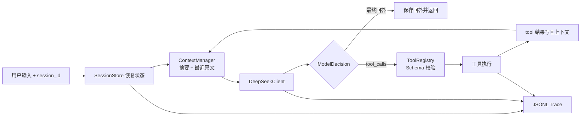

# Minimal DeepSeek Agent Runtime

[](https://www.python.org/)
[](LICENSE)

一个不依赖 LangGraph、OpenHands、OpenClaw 等 Agent 框架的最小可用 Agent。
核心循环、工具注册、LLM 输出解析、session、context 压缩、trace 与异常边界均自行实现。

## 功能对照

| 题目要求 | 实现 |
|---|---|
| 真实 LLM API | DeepSeek OpenAI-compatible `/chat/completions` |
| 基本 Agent Loop | 直接回答 → 工具调用 → 工具结果 → 继续或结束 |
| 工具注册机制 | 名称、描述、JSON Schema、执行器统一注册 |
| 至少三个工具 | `calculator`、`search`、`todo`、`weather`、`read_docs` |
| 输出解析 | 原生 `tool_calls`、`reasoning_content`/`<think>` 提取、JSON 降级协议 |
| session 隔离 | 每个 `session_id` 独立持久化消息、摘要、待办和 trace |
| 持续对话/追问 | 每轮恢复同一 session 的最近原文、摘要和工具结果 |
| context 管理 | 消息数/字符双阈值，保留近期原文，压缩较早事件 |
| 最大轮次 | `AGENT_MAX_STEPS`，触顶后执行一次无工具的最终归纳 |
| 异常处理 | API 重试、HTTP 错误、Schema 校验、工具错误隔离、路径防穿越 |
| trace | 每个 session 一个 append-only JSONL |
| 测试 | 17 个离线单元/集成测试，不消耗 API |

DeepSeek 当前官方文档给出的 OpenAI 格式 Base URL 是
`https://api.deepseek.com`，工具调用使用 JSON Schema。默认模型使用
`deepseek-v4-flash`；可在 `.env` 切换。参考：
[DeepSeek 首次 API 调用](https://api-docs.deepseek.com/guides/function_calling/)、
[DeepSeek Tool Calls](https://api-docs.deepseek.com/guides/tool_calls)。

## 立即运行

要求 Python 3.10+，运行时无第三方依赖。

1. 打开项目根目录的 `.env`，填写：

   ```dotenv
   DEEPSEEK_API_KEY=你的_key
   ```

2. 启动持续对话：

   ```powershell
   python main.py
   ```

   启动后终端会持续显示 `you>`。输入问题并按回车，Agent 回答后会再次等待输入；
   使用 `/trace` 查看日志、`/help` 查看命令、`/exit` 保存并退出。

3. 使用独立 session 或显示工具调用：

   ```powershell
   python main.py --session window-1 --show-trace
   ```

4. 单次提问：

   ```powershell
   python -m mini_agent ask "计算 (123+456)*7，并把结果加入待办" --session window-1 --show-trace
   ```

原有模块命令同样可以启动持续对话：

```powershell
python -m mini_agent chat --session window-1 --show-trace
```

不安装也能使用 `python -m mini_agent`。如需安装命令：

```powershell
python -m pip install -e .
mini-agent chat --session window-1
```

常用命令：

```powershell
python -m mini_agent sessions
python -m mini_agent trace --session window-1 --limit 30
python -m unittest discover -s tests -v
```

## 演示 session 隔离

终端 1：

```powershell
python -m mini_agent chat --session window-1
```

依次输入：

```text
查一下上海今天的天气，并记一个“下班带伞”的待办
我刚才查的是哪里？列出这个窗口的待办
```

终端 2：

```powershell
python -m mini_agent chat --session window-2
```

依次输入：

```text
帮我记一个“写周报”的待办
列出这个窗口的待办
```

两个窗口的数据分别位于 `.agent_data/sessions/window-1.json` 和
`.agent_data/sessions/window-2.json`。窗口 2 不会看到窗口 1 的天气或待办。

## 系统设计



### 核心循环

`AgentRuntime.run()` 每一步都把 system prompt、session 摘要和最近消息发给模型。
模型可以直接回复，也可以返回一个或多个 `tool_calls`。Runtime 校验参数并执行工具，
再用带 `tool_call_id` 的 `tool` 消息把结果交回模型。达到信息充分或最大步数时结束。

工具异常会变成 `{"ok": false, "error": ...}` 的可观察结果，模型可据此修正参数；
单个工具崩溃不会使整个进程直接退出。每次有副作用的工具执行后立即保存 session，
即使进程意外退出也尽量不丢待办状态。

### 工具注册

每个工具继承 `Tool`，提供：

- `name`：唯一工具名；
- `description`：帮助模型判断调用时机；
- `parameters`：JSON Schema；
- `execute(arguments, context)`：实际执行。

新增工具后在 `mini_agent/tools/builtin.py` 注册即可。Runtime 不含任何具体工具分支。

### Session 与 memory 的召回时机

这里的 memory 分为三层：

1. **最近消息**：用户原话、assistant 回答、工具调用与工具结果；
2. **压缩摘要**：较早对话的关键事实、已执行动作和结果；
3. **结构化状态**：例如 `session.state.todos`，不靠语言模型猜测。

召回发生在每次 `run()` 开始时：先按 `session_id` 从磁盘恢复，再在模型调用前把
system prompt、摘要、最近原文依次放入 context。摘要被放在 system 层的背景区，
并明确“最近原文冲突时以最近原文为准”；结构化待办只由 `todo` 工具访问，避免把
所有状态反复塞进 prompt。工具执行结果会紧跟对应 assistant tool call 放置，
保证 `tool_call_id` 可追溯。

当前项目只实现 session 内 memory，不做跨 session 的用户画像，这正是窗口隔离要求。
生产系统若需要跨 session 长期记忆，应独立增加带用户授权、来源和过期时间的 memory
store，并在意图识别后按需检索，不能直接混入所有对话。

### Context 压缩

触发条件是消息数超过 `AGENT_CONTEXT_MAX_MESSAGES`，或序列化字符数超过
`AGENT_CONTEXT_MAX_CHARS`。算法保留最近一半（至少 6 条）原文，把更早消息转为
有角色标记的紧凑摘要；工具调用保留工具名，工具结果保留截断后的关键内容。

这是“基础压缩”的刻意实现：确定、便宜、可测试。它不等价于高质量语义摘要。
生产版本可把旧消息异步送给便宜模型做结构化 summary，并保留原始事件日志用于回放。

### Trace 与隐私

`.agent_data/traces/<session_id>.jsonl` 记录：

`run_started → model_decision → tool_started → tool_finished → run_finished`。

默认不落盘模型隐藏推理；`AGENT_TRACE_REASONING=true` 仅用于受控调试。产品上更推荐
记录“为何选这个工具”的短决策摘要，而不是保存完整 chain-of-thought。

## 项目结构

```text
mini_agent/
  cli.py              CLI 与交互会话
  config.py           .env 读取和运行配置
  context.py          context 组装与基础压缩
  llm.py              DeepSeek HTTP 客户端与输出解析
  runtime.py          Agent Loop
  session_store.py    session 原子持久化
  tracing.py          JSONL trace
  tools/              工具抽象、注册表和 5 个工具
tests/                离线测试
main.py               最简单的交互式启动入口
docs/
  README.md
  architecture-interview.md
  ai-prompts-and-notes.md
  demo-recording-guide.md
  submission-checklist.md
  knowledge.md
```

更多说明见 [docs/README.md](docs/README.md)。

## 安全和边界

- `calculator` 使用 AST 白名单，不调用 `eval`；
- `read_docs` 只允许访问 `docs` 内的 `.md/.txt/.json`，阻断 `../` 穿越；
- tool arguments 在执行前按 Schema 的 required/type/enum 做基础校验；
- API 对 408、429、5xx 与网络错误做指数退避重试；
- session_id 有字符白名单，避免借文件名写出数据目录；
- `.env` 与 `.agent_data/` 已加入 `.gitignore`。

`search` 和 `weather` 按题目允许使用确定性 mock，并在结果中显式标记 `mock: true`；
真实 LLM 调度和所有其他 Runtime 逻辑不是 mock。

## 已知取舍

- 纯标准库 HTTP 客户端保持项目轻量，但没有 SDK 的流式事件封装；
- 文件 session store 适合笔试和单机演示，不支持多进程高并发写；
- 基础压缩不做事实去重、实体合并和语义检索；
- mock 搜索/天气不能作为真实世界事实来源。

生产化下一步应是：数据库事件存储、session actor/锁、流式输出、异步工具队列、
可观测指标、真实搜索与天气 API、结构化长期 memory 及基于任务的 eval。
